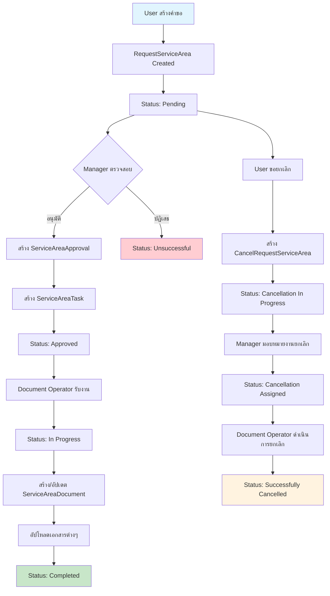
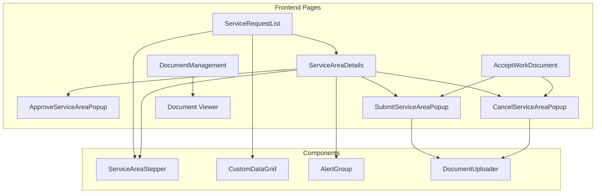
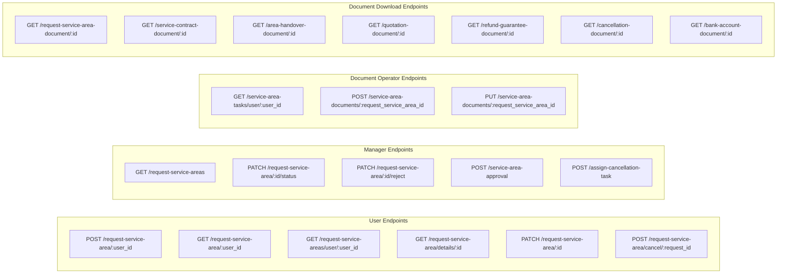
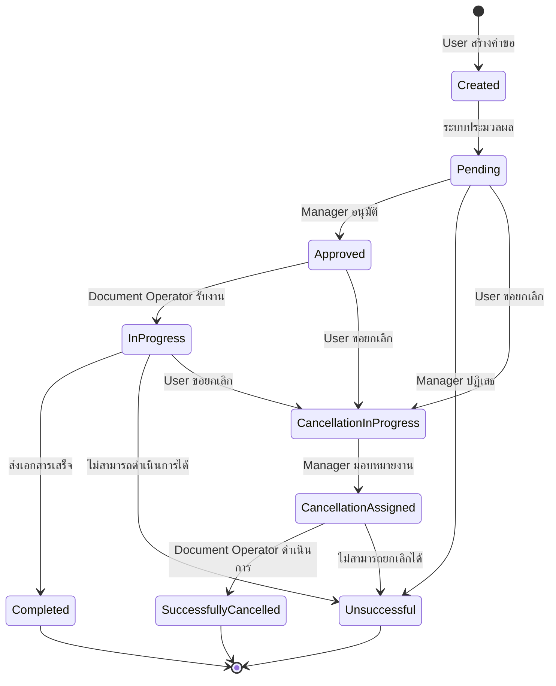
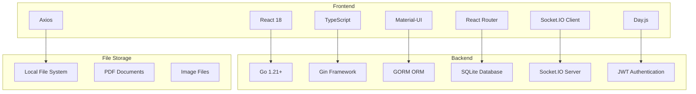

# Request Service Area System Architecture

## Entity Relationship Diagram

```mermaid
erDiagram
    User ||--o{ RequestServiceArea : "creates"
    RequestServiceArea ||--|| RequestStatus : "has"
    RequestServiceArea ||--o| ServiceAreaDocument : "has"
    RequestServiceArea ||--o| ServiceAreaApproval : "has"
    RequestServiceArea ||--o| ServiceAreaTask : "has"
    RequestServiceArea ||--o| CancelRequestServiceArea : "has"
    RequestServiceArea ||--o{ CollaborationPlan : "has"
    RequestServiceArea ||--o{ Notification : "generates"
    
    ServiceAreaDocument ||--|| Room : "assigned_to"
    ServiceAreaDocument ||--|| ServiceUserType : "has"
    
    ServiceAreaTask ||--|| User : "assigned_to"
    ServiceAreaTask ||--o{ Notification : "generates"
    
    ServiceAreaApproval ||--|| User : "approved_by"
    
    CancelRequestServiceArea ||--|| User : "requested_by"
    CancelRequestServiceArea ||--o{ Notification : "generates"
    
    User {
        uint ID PK
        string FirstName
        string LastName
        string Email
        string CompanyName
    }
    
    RequestServiceArea {
        uint ID PK
        uint UserID FK
        uint RequestStatusID FK
        string PurposeOfUsingSpace
        int NumberOfEmployees
        string ActivitiesInBuilding
        string SupportingActivitiesForSciencePark
        string ServiceRequestDocument
    }
    
    RequestStatus {
        uint ID PK
        string Name
        string Description
    }
    
    ServiceAreaDocument {
        uint ID PK
        uint RequestServiceAreaID FK
        string ServiceContractDocument
        string AreaHandoverDocument
        string QuotationDocument
        string RefundGuaranteeDocument
        string ContractNumber
        time.Time ContractStartAt
        time.Time ContractEndAt
        uint RoomID FK
        uint ServiceUserTypeID FK
    }
    
    ServiceAreaTask {
        uint ID PK
        string Note
        uint UserID FK
        uint RequestServiceAreaID FK
        bool IsCancel
    }
    
    ServiceAreaApproval {
        uint ID PK
        string Note
        uint UserID FK
        uint RequestServiceAreaID FK
    }
    
    CancelRequestServiceArea {
        uint ID PK
        uint RequestServiceAreaID FK
        uint UserID FK
        string PurposeOfCancellation
        string ProjectActivities
        float64 AnnualIncome
        string CancellationDocument
        string BankAccountDocument
    }
    
    CollaborationPlan {
        uint ID PK
        uint RequestServiceAreaID FK
        string CollaborationPlan
        float64 CollaborationBudget
        time.Time ProjectStartDate
    }
    
    Room {
        uint ID PK
        string RoomNumber
        string Description
    }
    
    ServiceUserType {
        uint ID PK
        string Name
        string Description
    }
    
    Notification {
        uint ID PK
        bool IsRead
        uint ServiceAreaRequestID FK
        uint ServiceAreaTaskID FK
        uint CancelServiceAreaRequestID FK
        uint UserID FK
    }
```

## System Workflow Diagram



## Frontend Pages Architecture



## API Endpoints Structure



## Status Flow Diagram



## Technology Stack



## Key Features

### Frontend Features
- 📱 **Responsive Design** - รองรับทุกขนาดหน้าจอ
- 🔔 **Real-time Notifications** - ใช้ Socket.IO
- 📁 **File Upload** - รองรับ PDF, รูปภาพ
- 📊 **Data Grid** - แสดงข้อมูลแบบตารางพร้อม pagination
- 📈 **Stepper Component** - แสดงขั้นตอนการทำงาน
- ⚠️ **Alert System** - แสดงข้อความแจ้งเตือน
- 🔍 **Search & Filter** - ค้นหาและกรองข้อมูล

### Backend Features
- 🔐 **JWT Authentication** - ระบบยืนยันตัวตน
- 🛡️ **Role-based Access Control** - ควบคุมการเข้าถึงตามบทบาท
- 📝 **RESTful API** - API ตามมาตรฐาน REST
- 🗄️ **ORM with GORM** - จัดการฐานข้อมูลด้วย ORM
- 📄 **File Upload/Download** - จัดการไฟล์เอกสาร
- 🔄 **Real-time Updates** - อัปเดตแบบ real-time
- 📊 **Pagination & Filtering** - รองรับการแบ่งหน้าและกรองข้อมูล

### Database Features
- 🏗️ **Relational Database** - ฐานข้อมูลเชิงสัมพันธ์
- 🔗 **Foreign Key Constraints** - ควบคุมความถูกต้องของข้อมูล
- 📈 **Indexing** - เพิ่มประสิทธิภาพการค้นหา
- 🗃️ **Soft Delete** - ลบข้อมูลแบบ soft delete
- ⏰ **Timestamps** - บันทึกเวลาสร้างและอัปเดต
